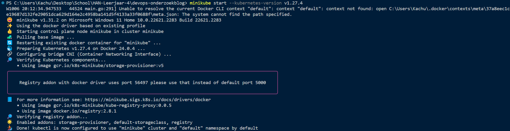
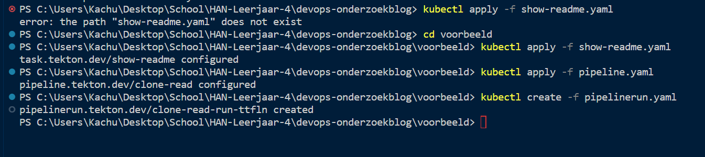
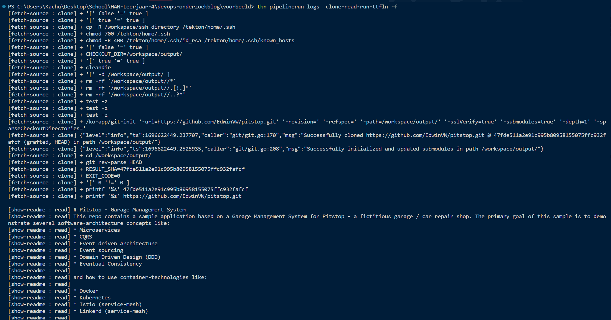

# *Tekton: De Toekomst van CI/CD voor Cloud-Native Apps op Kubernetes*

" align="right">

Dit blog is geschreven om inzicht te geven op een DevOps tool voor de DevOps minor. In dit geval gaat het over Tekton CI/CD. Het doel van deze blog is om ontwikkelaars kennis te laten maken met Tekton. Het is sterk aangeraden om al kennis te hebben van Kubernetes en Linux om commando's uit te voeren in de pipelines. Kennis van andere CI/CD systemen is een pre. Dit helpt wel om de concepten van CI/CD systemen en pipelines te begrijpen.

Eerst volgt er een algemene introductie voor Tekton CI/CD. Hierin beschrijf ik wat CI/CD systemen inhoudt om Tekton beter te begrijpen. Daarna komt er een beschrijving van wat Tekton CI/CD is en hoe het werkt. Hierbij ga ik wat dieper in het ecosysteem en kenmerken door verschillende termen te beschrijven om het systeem zo helder mogelijk te krijgen.

Dan bekijk ik wat voor sterke en zwakke punten er zijn bij het gebruik van Tekton. Daarna volgt er een demo voor Tekton waarbij ik laat zien hoe het readme bestand uit een bepaalde repository te lezen is. Vervolgens beschrijf ik een aantal uitdagingen die er zijn om Tekton te kunnen implementeren. Als laatst volgt er een conclusie waarbij ik samenvat wat er in de blog is beschreven, en geef ik mijn mening over Tekton.

## CI/CD Systemen

De afkorting CI/CD staat voor respectievelijk Continuous Integration en Continuous Deployment. Continuous integration houdt in dat ontwikkelaars regelmatig hun code integreren in een gedeelde repository. Het testen van de code gaat vaak automatisch via een pipeline d.m.v. automatische tests, waardoor ontwikkelaars eventuele conflicten of fouten vroegtijdig kunnen ontdekken en oplossen.
Continuous Deployment bouwt hier verder op in door de code na het automatisch testen, via de pipeline direct te deployen op de productieomgeving. Dit betekent dat wijzigingen vaak snel plaatsvinden (Working Talent, z.d.).

Beide processen zijn belangrijk om software snel op te kunnen leveren met zo min mogelijke fouten en conflicten. Door constant te controleren hierop, is het makkelijker voor ontwikkelaars om samen te werken. Een aantal voorbeelden van CI/CD systemen zijn [Gitlab CI/CD](https://docs.gitlab.com/ee/ci/), [Github Actions](https://github.com/features/actions) of [Azure DevOps](https://azure.microsoft.com/nl-nl/products/devops).


**Figuur 1: De werking van een pipeline in een CI/CD systeem (Microsoft, 2022).**

De pipeline is vaak te configureren d.m.v. een YAML-bestand. Een pipeline gaat alleen af door een bepaalde trigger. Denk bijvoorbeeld hierbij aan wanneer een ontwikkelaar code pusht naar het versiebeersysteem. Een pipeline bestaat vaak uit een aantal stages of fases, zoals het bouwen, testen en releasen van een applicatie. Dit soort fases zijn in figuur 1 gedefinieerd als een stage. Elk stage bevat een agent, wat ook bekend is als een image, bijvoorbeeld een Ubuntu image. De pipeline heeft een kleine virtuele omgeving waar de applicatie op Ubuntu draait voor een specifieke stage. Zodra de pipeline doorgaat naar de volgende stage, kan er zomaar een ander agent draaien (Microsoft, 2022).

Als laatst komen de stappen (steps in figuur 1). Dit zijn vooral de commando's die de pipeline uitvoert. Denk hierbij aan commando's zoals het bouwen van een bepaalde applicatie, of het uitvoeren van een test in de command line. Ook kan de pipeline taken zoals bepaalde scripts uitvoeren. In het afbeelding gaat dit bijvoorbeeld om het aanroepen van een API, of het deployen van een applicatie. Hiervoor is het handig om kennis van Linux te hebben.

Nu dat de werking van het CI/CD systemen d.m.v. pipelines en een aantal termen daarbij duidelijker zijn, is het makkelijker om de stap naar Tekton te maken.

## Wat is Tekton?

Tekton is een open-source framework dat cloud-native applicaties bouwt, test en implementeert. Het is specifiek ontworpen om CI/CD (Continuous Integration/Continuous Deployment) pipelines te definiëren en uit te voeren in een Kubernetes-omgeving. Hierdoor kunnen ontwikkelaars via cloud providers zoals Kubernetes hun applicatie bouwen, testen en deployen (Tekton, z.d.).

Er zijn aardig wat overeenkomsten tussen andere CI/CD Tools. Het grootste verschil is dat Tekton vooral de nadruk op containerisatie zet. Daarom is Tekton op Kubernetes gebouwd. Tekton maakt en voert alle instanties van taken en pipelines uit op verschillende containers. Deze pipelines zijn van tevoren te configureren met YAML-bestanden. Bij Gitlab CI/CD is er een voorgeconfigureerde Gitlab runner nodig om pipelines te kunnen draaien.  

## Hoe werkt Tekton?

Tekton maakt gebruik van een reeks van Kubernetes resources die samenwerken om CI/CD pipelines te definiëren en uit te voeren. Hierdoor is het makkelijker om Tekton met een bestaande Kubernetes infrastructuur te integreren (Amir, 2023). Veel termen zijn al beschreven in het hoofdstuk [CI/CD Systemen](#cicd-systemen). Tekton heeft in het ecosysteem ook zijn eigen termen. Hieronder deel ik de termen op door termen die we al tegengekomen zijn en termen die vooral voor Tekton relevant zijn.

### Bekende termen

**Step**: Een step is een uitvoering van een commando in CI/CD, zoals het uitvoeren van unit tests, of het implementeren van een applicatie. Tekton voert elke stap uit met een Docker container image (Tekton, z.d.). In het hoofdstuk [CI/CD Systemen](#cicd-systemen) is dit beschreven als een stap.

**Pipeline:** Een pipeline in Tekton bestaat uit een collectie *tasks* die Tekton op een bepaalde volgorde uitvoert. Hiermee kunnen ontwikkelaars complexe workflows definiëren die bestaan uit meerdere taken.

**Trigger:** Het is mogelijk om Tekton te integreren met triggersystemen, waardoor pipelines af gaan op basis van gebeurtenissen zoals codecommits, pull requests of andere gebeurtenissen in een versiebeheersysteem. Dit gebeurt op basis van [Eventlisteners](https://tekton.dev/docs/triggers/eventlisteners/).

Vanaf dit punt in de blog zal ik de term step gebruiken, in plaats van stap. Dit is voornamelijk omdat dit term in Tekton zo gedefinieerd is.

### Nieuwe termen binnen Tekton


**Figuur 2: Een Taskrun die meerdere tasks bevat in een pipeline (Tekton, z.d.).**

**Tasks:** Een task bestaat uit een collectie van *steps*. Het is een geautomatiseerde step die specifieke acties uitvoert, zoals het bouwen van een containerimage of het deployen van een applicatie.

**Resources:** Tekton maakt gebruik van resources om input- en outputgegevens van een pipeline te beheren. Dit kunnen bijvoorbeeld broncode-repositories, container-images, configuratiebestanden of andere artefacten zijn.

**PipelineRun:** Dit zijn instanties van een bepaalde pipeline. Een Pipeline is een blauwdruk die de steps en taken definieert om een CI/CD proces uit te voeren. Wanneer je een Pipeline uitvoert, creëert Tekton een PipelineRun. Dit vertegenwoordigt een specifieke uitvoering of instantie van die pipeline. Het bevat informatie over wanneer het is gestart, welke resources worden gebruikt en de status van elke task binnen de pipeline.

**TaskRuns**: Deze zijn vergelijkbaar met PipelineRuns, maar zijn gericht op individuele *tasks* binnen een pipeline. Wanneer een task in de pipeline draait, wordt er in de pipeline een TaskRun gemaakt om die specifieke instantie van de task te vertegenwoordigen. Het bevat informatie over de uitvoering van die task, inclusief status, eventuele fouten en de uitvoer ervan (Gravestijn, 2021).

**Workspaces:** Workspaces bieden een manier om gegevens tussen taken in een pipeline te delen. Ze stellen taken in staat om gegevens te schrijven naar en te lezen uit een gedeelde opslagplaats.

## Kenmerken en voordelen

Tekton maakt gebruik van YAML-bestanden om CI/CD pipelines te definiëren. Dit maakt het makkelijker om de pipelines te begrijpen en te beheren. Tekton bevordert een infrastructuur-als-code aanpak door gebruik van YAML-configuratie. Dit is in principe hetzelfde als Gitlab en Github. Beide CI/CD systemen maken namelijk gebruik van een YAML-bestand om de configuratie van de pipeline te beschrijven.

Ook brengt Tekton een aantal voordelen voor developers die CI/CD systemen bouwen:

- **Platformonafhankelijkheid**: Tekton draait op Kubernetes als een set van [Kubernetes Custom Resource](https://kubernetes.io/docs/concepts/extend-kubernetes/api-extension/custom-resources/), waardoor Tekton niet afhankelijk is van een specifiek platform en los draait van andere Kubernetes resources (Widmer, 2022).
- **Native Kubernetes-integratie**: Tekton is ontworpen om naadloos samen te werken met Kubernetes. Het maakt gebruik van Kubernetes-podspecs om taken uit te voeren, waardoor het eenvoudig te integreren is in bestaande Kubernetes-omgevingen (Platform9, 2023).
- **Declaratieve configuratie**: Tekton maakt gebruik van YAML-bestanden voor het definiëren van pipelines, taken en resources. Dit zorgt voor een eenvoudige en begrijpelijke manier om CI/CD pipelines te definiëren en te onderhouden. Het is hierdoor makkelijker om deze pipelines in verschillende projecten neer te zetten door de herbruikbaarheid als de configuratie op Git staat.
- **Schaalbaarheid**: Door gebruik te maken van Kubernetes voor het orkestreren van taken, profiteert Tekton van de schaalbaarheid en betrouwbaarheid van het Kubernetes-platform. Hierdoor kunnen teams pipelines uitvoeren op een schaal die geschikt is voor hun project, bijvoorbeeld meerdere microservices met een of meerdere pipelines. Als er een vraag naar capaciteit is, is het zo simpel als meer nodes aan een Kubernetes cluster toevoegen. Het is dan niet nodig om de pipeline aan te passen omdat Tekton automatisch schaalt (Tekton, z.d.).
- **Uitbreidbaar**: Via [Tekton Hub](https://hub.tekton.dev/) is het makkelijk om nieuwe pipelines te maken met voorgedefinieerde componenten of gebruik te maken van pipelines die anderen hebben gemaakt (Gravestijn, 2021).
- **Combinatie ArgoCD**: Waar Tekton voor het hele development zorgt, zoals het bouwen van de applicatie tot het pushen naar een git repository, kan ArgoCD met de Git repo een nieuwe Kubernetes cluster uitrollen (Minkowski, 2021). Dit is terug te zien in figuur 3.

 **Figuur 3: Tekton en ArgoCD gecombineerd (Minkowski, 2021).**

## Uitlezen README van Pitstop met Tekton

Voor een praktisch voorbeeld gaan we de [Pitstop](https://github.com/EdwinVW/pitstop) clonen en de readme bestand daarvan uitlezen met de [Cat](https://www.geeksforgeeks.org/cat-command-in-linux-with-examples/) commando. In het praktijk heeft dit vaak niet zoveel toegevoegde waarde. Echter is het goed om te weten of het clonen van een repository gelukt is. Dit is één van de manieren om het te bereiken. Het clonen van een repository is vaak de eerste step binnen een CI/CD die een ontwikkelaar uitvoert binnen een pipeline, zodat de pipeline o.a. de applicatie zelf kan bouwen en eventueel een Docker image beschikbaar kan stellen.

Minimale vooreisen om de demo uit te kunnen voeren:

- **Minikube:** Hiermee is het mogelijk om een lokale Kubernetes Cluster te draaien. Als het goed is, zit dit standaard bij Docker Desktop inbegrepen
- **Kubectl:** Command line om met de Kubernetes Cluster te kunnen interacteren.
- **tkn:** Command line voor Tekton. Hiermee is het mogelijk om Tekton commando's uit te voeren voor de Kubernetes Cluster

Tkn is op [meerdere manieren](https://tekton.dev/docs/cli/) te installeren. Zelf heb ik het met Chocolatey voor Windows gedaan, aangezien een package manager vaak de makkelijkste weg is voor het installeren van zo'n package.

1.Start Kubernetes lokaal op met minikube:

```text
minikube start --kubernetes-version v1.27.4
```

Kubernetes is als het goed is beschikbaar op de lokale machine, zoals te zien in figuur 4.


**Figuur 4: Het succesvol opstarten van Minikube in de terminal.**

2.Deploy Tekton op de Kubernetes cluster.

```text
kubectl apply --filename https://storage.googleapis.com/tekton-releases/pipeline/latest/release.yaml
```

Nu zijn er allerlei [Tekton componenten](https://tekton.dev/docs/concepts/overview/#what-are-the-components-of-tekton) geinstalleerd, waarbij het mogelijk is om gebruik te maken van het ecosysteem van Tekton.

2.Maak een nieuwe bestand aan die de pipeline definieert, genaamd `pipeline.yaml`. Het is handiger om dit in een ander folder te doen dan in de root.

3.Voeg in `pipeline.yaml` het volgende toe:

- Een configuratie toe met een parameter die de pipeline run moet ontvangen.
- Een referentie naar een workspace zodat de pipelinerun de gedownloade bestanden kan opslaan. Dit is vergelijkbaar met [Caching in Gitlab](https://docs.gitlab.com/ee/ci/caching/).
- De task die de geconfigureerde parameter en de referentie van de workspace gebruikt. Zie onderstaande YAML-bestand voor een voorbeeld.

```yaml
apiVersion: tekton.dev/v1beta1
kind: Pipeline
metadata:
  name: clone-read
spec:
  description: | 
    This pipeline clones a git repo, then echoes the README file to the stout.
  params:
  - name: repo-url
    type: string
    description: The git repo URL to clone from.
  workspaces:
  - name: shared-data
    description: | 
      This workspace contains the cloned repo files, so they can be read by the
      next task.
  - name: git-credentials
    description: My ssh credentials
  tasks:
  - name: fetch-source
    taskRef:
      name: git-clone
    workspaces:
    - name: output
      workspace: shared-data
    - name: ssh-directory
      workspace: git-credentials
    params:
    - name: url
      value: $(params.repo-url)
```

4.Maak daarna een nieuwe `pipelinerun.yaml` aan. De pipelinerun instantieert de Pipeline die in stap 3 is gedefinieerd. Gebruik de workspace die in `pipeline.yaml` gedefinieerd is. De grootte van de workspace is zelf in te stellen.

```yaml
apiVersion: tekton.dev/v1beta1
kind: PipelineRun
metadata:
  generateName: clone-read-run-
spec:
  pipelineRef:
    name: clone-read
  podTemplate:
    securityContext:
      fsGroup: 65532
  workspaces:
  - name: shared-data
    volumeClaimTemplate:
      spec:
        accessModes:
        - ReadWriteOnce
        resources:
          requests:
            storage: 1Gi
  - name: git-credentials
    secret:
      secretName: git-secret
```

5.Zet de URL van de git repository hierin als parameter binnen de spec. In dit geval is dit de Pitstop applicatie via HTTPS.

```yaml
  params:
  - name: repo-url
    value: https://github.com/EdwinVW/pitstop.git
```

5a.*Optioneel*: Maak gebruik van SSH om Pitstop te clonen. Hierbij is het gebruik van [Kubernetes SSH authentication Secrets](https://kubernetes.io/docs/concepts/configuration/secret/#ssh-authentication-secrets) van belang om de private key op te kunnen slaan.

6.Definieer een tweede task genaamd `show-readme.yaml` die de readme bestand van Pitstop leest.

```yaml
apiVersion: tekton.dev/v1beta1
kind: Task
metadata:
  name: show-readme
spec:
  description: Read and display README file.
  workspaces:
  - name: source
  steps:
  - name: read
    image: alpine:latest
    script: | 
      #!/usr/bin/env sh
      cat $(workspaces.source.path)/README.md
```

7.Klik terug op `pipeline.yaml` en voeg binnen de spec onder `tasks` de tweede task toe.

```yaml
  tasks:
  - name: show-readme
    runAfter: ["fetch-source"]
    taskRef:
      name: show-readme
    workspaces:
    - name: source
      workspace: shared-data
```

8.Installeer met `kubectl` of `tkn` de git-clone task vanuit de [Tekton Catalog](https://hub.tekton.dev/tekton/task/git-clone).

```text
tkn hub install task git-clone
```

```text
kubectl apply -f https://raw.githubusercontent.com/tektoncd/catalog/main/task/git-clone/0.6/git-clone.yaml
```

9.Navigeer naar de folder waarin de YAML-bestanden staan. Pas nu alle Tekton YAML-bestanden toe met `kubectl apply` en creeër daarna een pipeline run met `kubectl create`. Ik heb dit zelf allemaal één voor één gedaan.

```text
cd voorbeeld

kubectl apply -f show-readme.yaml

kubectl apply -f pipeline.yaml

kubectl create -f pipelinerun.yaml

```

Er komt een pipelinerun terug met een unieke naam, zoals te zien in figuur 5.


**Figuur 5: Een unieke pipelinerun dat de show-readme task en de pipeline bevat.**

10.Het is nu mogelijk om de logs van de Pipeline run te bekijken. Als het goed is komt hier de Readme van Pitstop terug door het volgende commando uit te voeren:

```text
tkn pipelinerun logs  clone-read-run-ttfln -f
```

**Figuur 6: De readme van pitstop, uitgelezen met behulp van Tekton.**

Nu weten we dat het clonen van de repository gelukt is. Als er een Dockerfile ergens in de repository zou zitten, is het met [Kaniko](https://github.com/GoogleContainerTools/kaniko) mogelijk om een Docker image te bouwen en deze image beschikbaar te stellen op een externe registry zoals [Docker Hub](https://hub.docker.com/) of [Github Container Registry](https://docs.github.com/en/packages/working-with-a-github-packages-registry/working-with-the-container-registry). Systemen met Docker kunnen deze images dan makkelijk ophalen.

## Uitdagingen

Het implementeren van Tekton CI/CD in een ontwikkelteam kan veel voordelen bieden, zoals gestroomlijnde en geautomatiseerde deployment pipelines, maar zoals bij veel technologieën zijn er uitdagingen en nadelen bij de implementatie ervan:

- **Complexiteit van YAML**: Tekton gebruikt YAML-bestanden voor het definiëren van pipelines. Deze YAML-bestanden kunnen complex worden, vooral bij grotere en complexere CI/CD pipelines

- **Leercurve**: Ontwikkelaars moeten Kubernetes goed onder de knie hebben om te kunnen beginnen aan Tekton. Het helpt als er al kennis van andere CI/CD systemen zijn, aangezien de concepten vergelijkbaar zijn.

- **Bestaande CI/CD systemen**: Als er al bestaande CI/CD tools en processen zijn, kan het integreren van Tekton met deze systemen een uitdaging zijn. Dit kan aanpassingen aan bestaande workflows vereisen.

- **Resource Management**: Het beheren van resources zoals Workspaces, Secrets en ConfigMaps kan complex zijn, vooral als er een complexe applicatiestructuur is.

- **Ondersteuning van community**: Vergeleken met meer bekende CI/CD Systemen, is het met Tekton een stuk lastiger om naar oplossingen te zoeken op problemen waar je tegenaan loopt (ChatGPT, 2023).

## Conclusie

In dit blog hebben we gekeken wat CI/CD systemen over het algemeen inhoudt inclusief de concepten. Daarna hebben we gezien wat Tekton is, hoe Tekton werkt en de concepten hiervan. We hebben zowel bekende termen van andere CI/CD systemen als termen die exclusief in het Tekton ecosysteem gezien. Vervolgens hebben we de kenmerken en voordelen van Tekton bekeken, en een demo uitgevoerd door de readme van de Pitstop repository uit te lezen om te controleren of het clonen van een repository gelukt is. Als laatst hebben we nog naar uitdagingen gekeken dat je tegen kan komen als je Tekton wilt gebruiken.

Het opzetten van Tekton vond ik lastig om te doen. Dit komt vooral door de combinatie van Kubernetes en de moeilijkheid om naar oplossingen bij problemen te zoeken. Dat laatste komt vooral omdat Tekton alleen voor Kubernetes gemaakt is, waardoor de community niet zo groot als Gitlab CI/CD of Github Actions is.

Ik kan wel de potentie zien als je al aardig veel ervaring met Kubernetes hebt, omdat de pipelines makkelijk te hergebruiken en in te zetten zijn door het gebruik van de YAML-bestanden. Ook omdat Tekton voornamelijk in Kubernetes draait, waardoor je meer controle hebt als je de cluster kan configureren. Bij Gitlab CI/CD en Github Actions moet je nog een aparte runner instellen waar de pipeline op draait. Dit is bij Tekton niet nodig, wat ook een voordeel kan zijn.

Voor ontwikkelaars met veel Kubernetes ervaring kan ik Tekton zeker aanraden om daarmee te werken. Zelf zou ik Tekton pas gebruiken zodra ik meer ervaring met pipelines en Kubernetes heb. Op dit moment zie ik bij mezelf geen reden om van standaard CI/CD systemen af te gaan.

## Bronnen

Working Talent. (z.d.). *Wat is Continuous Integration/Continuous Deployment?* Geraadpleegd op 8 december 2023, van <https://www.workingtalent.nl/continuous-integration-continuous-deployment>

Microsoft. (2022, 21 december). *Key concepts overview.* Geraadpleegd op 8 december 2023, van <https://learn.microsoft.com/en-us/azure/devops/pipelines/get-started/key-pipelines-concepts?view=azure-devops>

Tekton. (z.d.). *Tekton.* Geraadpleegd op 08 december 2023, van <https://tekton.dev/>

Amir, R. (2023, 4 april). *GitHub Actions vs Bitbucket Pipelines vs GitLab CI vs Tekton: The best CI/CD tool for you?* Stakater. Geraadpleegd op 5 december 2023, van <https://www.stakater.com/post/github-actions-vs-bitbucket-pipelines-vs-gitlab-ci-vs-tekton-bestcicdtool>

Tekton. (z.d.). *Overview.* Geraadpleegd op 5 december 2023, van <https://tekton.dev/docs/concepts/overview>

Gravestijn, T. (2021, 27 oktober). *Tekton – De manier om cloud native CI/CD pipelines op te zetten.* HCS Company. Geraadpleegd op 8 december 2023, van <https://www.hcs-company.com/blog/tekton/>

Widmer, V. (2022, 25 januari). *Cloud Native CI/CD with Tekton and ArgoCD on AWS.* Amazon Web Services. Geraadpleegd op 8 december 2023, van <https://aws.amazon.com/blogs/containers/cloud-native-ci-cd-with-tekton-and-argocd-on-aws/#:~:text=Tekton%20is%20an%20open-source,natively%20on%20top%20of%20Kubernetes>

Platform9. (2023, 1 maart). *Argo CD vs Tekton vs Jenkins X: Finding the Right GitOps Tooling.* Geraadpleegd op 8 december 2023, van <https://platform9.com/blog/argo-cd-vs-tekton-vs-jenkins-x-finding-the-right-gitops-tooling/>

Piotr.Minkowski. (2021, 5 augustus). *Kubernetes CI/CD with Tekton and ArgoCD - Piotr's TechBlog.* Piotr’s TechBlog. Geraadpleegd op 5 december 2023, van <https://piotrminkowski.com/2021/08/05/kubernetes-ci-cd-with-tekton-and-argocd/>

ChatGPT. (2023, 8 december). *Uitdagingen en nadelen bij implementatie Tekton.* OpenAI. Geraadpleegd op 8 december 2023, van <https://chat.openai.com/share/82ea004e-3352-44bc-9d46-9f889bcfc078>
